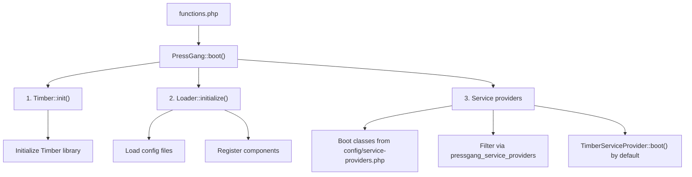

# Boot Sequence

Understanding how PressGang starts up helps you know where things happen and — just as importantly — where they should _not_ happen.

## Overview

PressGang boots from `functions.php` in three clean stages. Think of it as raising the anchor, setting the sails, and catching the wind:



## Stage by Stage



### 1. Composer Autoload

Before anything else, `functions.php` loads the Composer autoloader and defines the `THEMENAME` constant used for translations:


```php
if (!defined('THEMENAME')) {
    define('THEMENAME', 'pressgang');
}

$autoload_path = get_stylesheet_directory() . '/vendor/autoload.php';
if (file_exists($autoload_path)) {
    require_once $autoload_path;
}

(new PressGang\PressGang(
    new Loader(new FileConfigLoader())
))->boot();
```



Your child theme's `functions.php` should override `THEMENAME` with your own text domain before requiring the autoloader.




### 2. Timber Initialization

`Timber::init()` sets up the Timber library — connecting Twig to WordPress and preparing the template rendering pipeline.



### 3. Loader Initialization

The `Loader` performs two tasks:

**a) Load Components**

The `FileConfigLoader` reads every `*.php` file from the parent theme's `config/` directory, then merges in files from the child theme's `config/` directory (child overrides parent). The merged settings are cached for performance.

For each config key, the Loader converts it to a Configuration class name (e.g. `custom-post-types` → `CustomPostTypes`) and calls `initialize()` on the singleton instance:


```
config/sidebars.php         → Configuration\Sidebars::get_instance()->initialize($config)
config/custom-post-types.php → Configuration\CustomPostTypes::get_instance()->initialize($config)
config/scripts.php          → Configuration\Scripts::get_instance()->initialize($config)
```


**b) Include Files**

Shortcode and widget classes listed in `config/shortcodes.php` and `config/widgets.php` are included and registered. These use a different mechanism — they're `require`'d and instantiated directly rather than going through the Configuration singleton pattern.



### 4. Service Providers

Service providers are loaded from `config/service-providers.php` (then filtered by `pressgang_service_providers`).

By default this includes `TimberServiceProvider`, which wires up:

1. **Context Managers** — classes listed in `config/context-managers.php` are instantiated and hooked into `timber/context` to enrich every page's context.
2. **Twig Extensions** — classes listed in `config/twig-extensions.php` are instantiated and hooked into `timber/twig` to add custom functions, filters, and globals.
3. **Twig Environment Options** — `config/timber.php` is applied to `timber/twig/environment/options` (child themes can enable or disable Twig compilation cache per site).
4. **Snippet Template Paths** — the `pressgang-snippets` vendor views directory is added to Timber's template locations.




## Performance Rules


Never perform queries, I/O, or remote requests during boot. The boot sequence runs on every request — keep it fast!


* Config files must return arrays only — no queries, no logic branches, no side effects.
* Context managers should cache any non-trivial data (see [Context Managers](CONTEXT-MANAGERS.md)).
* Config is cached via `wp_cache` or transients (configurable with `PRESSGANG_CONFIG_CACHE_SECONDS`).
* To force a config reload: `PressGang\Bootstrap\Config::clear_cache()`.

## Filtering the Boot Process

Several hooks let you customize the boot:

| Hook | Type | Purpose |
|---|---|---|
| `pressgang_config_directories` | filter | Modify the list of config directories to load from |
| `pressgang_get_config` | filter | Filter the merged config array after loading |
| `pressgang_include_directories` | filter | Modify where the Loader looks for shortcode/widget files |
| `timber/context` | filter | Add data to the global Timber context |
| `timber/twig` | filter | Add functions/filters/globals to the Twig environment |
| `timber/twig/environment/options` | filter | Configure Twig environment options (cache, auto_reload, debug) |
| `pressgang_service_providers` | filter | Modify the list of service providers to boot |
