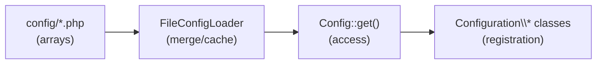

# Config

## Centralized Configuration Management

PressGang adopts a centralized approach to configuration, storing settings in dedicated files within the `config` directory. This structure simplifies the management and updating of theme settings, ensuring a clean and organized codebase.

No need to wrestle with tangled `functions.php` files — PressGang lets you chart your course with clean, declarative config.

### How It Works

1. **Config Files:** Individual PHP files within the `config` directory return associative arrays that define settings for various theme components.
2. **Loading and Configuration:** Loading of `config` files is handled in the `Bootstrap` namespace. The `FileConfigLoader` (implementing `ConfigLoaderInterface`) reads and merges configuration settings, supporting hierarchical overrides — child theme config always takes precedence over parent theme config. The `Configuration` namespace provides singleton classes that receive the config settings and apply the necessary logic.
3. **Central Access Point:** The `Config` class provides static methods to retrieve settings, ensuring a single point of access and enabling caching for performance.

### The Config Lifecycle



Each config file maps to a Configuration class by studly-case name:
- `config/sidebars.php` → `PressGang\Configuration\Sidebars`
- `config/custom-post-types.php` → `PressGang\Configuration\CustomPostTypes`

The class **must exist** — a config file alone does nothing without a corresponding Configuration class.

### Benefits for Theme Development


Convention over configuration reduces overhead and keeps your theme maintainable.


* **Streamlined Workflow:** Convention over configuration reduces the overhead associated with setting up and maintaining theme configurations.
* **Enhanced Maintainability:** The clear separation of configuration concerns into dedicated files makes the codebase easier to navigate and maintain.
* **Flexibility:** Developers can easily extend and customize the theme by adding new configuration files or modifying existing ones. Child theme config overrides parent theme config — no hooks or filters needed.

## Config Files

All files are present in the `config` folder of the PressGang theme. These can be overridden and modified to uniquely configure your child theme by following the same directory structure.

### Configuration Classes

These config files map to a singleton Configuration class that registers the defined items with WordPress:

<details>
<summary><strong>Content Types</strong></summary>

`custom-post-types.php`
Registers and configures custom post types.

`custom-taxonomies.php`
Defines and registers custom taxonomies.

`templates.php`
Registers custom page templates for the Page Attributes dropdown.

`timber-class-map.php`
Maps WordPress post types to custom Timber post classes.

</details>

<details>
<summary><strong>Navigation & Layout</strong></summary>

`menus.php`
Registers navigation menus.

`sidebars.php`
Registers widget sidebars.

`custom-menu-items.php`
Registers custom menu item types.

</details>

<details>
<summary><strong>Editor & Blocks</strong></summary>

`blocks.php`
Registers Gutenberg blocks. See the [Blocks](BLOCKS.md) page for details.

`block-categories.php`
Registers custom block categories for the Gutenberg editor.

`block-patterns.php`
Defines and registers block patterns.

`color-palette.php`
Configures custom color palettes for the editor.

</details>

<details>
<summary><strong>Assets</strong></summary>

`scripts.php`
Registers and enqueues scripts.

`styles.php`
Registers and enqueues styles.

`dequeue-styles.php`
Handles dequeueing of unwanted styles.

`deregister-scripts.php`
Manages deregistration of unwanted scripts.

</details>

<details>
<summary><strong>Theme Features</strong></summary>

`support.php`
Adds theme support features (e.g. `post-thumbnails`, `title-tag`).

`remove-support.php`
Handles removal of theme support features.

`customizer.php`
Registers WordPress Customizer sections and settings.

</details>

<details>
<summary><strong>Admin</strong></summary>

`remove-menus.php`
Configures removal of specific admin menus.

`remove-nodes.php`
Manages removal of admin bar nodes.

`query-vars.php`
Registers custom query variables.

</details>

<details>
<summary><strong>Integrations & Misc</strong></summary>

`acf-options.php`
Registers Advanced Custom Fields (ACF) options pages.

`actions.php`
Registers custom actions within the theme.

`meta-tags.php`
Manages meta tag configurations.

`plugins.php`
Manages required/recommended plugin declarations.

`routes.php`
Configures custom routes.

`snippets.php`
Configures snippet class loading. See the [Snippets](SNIPPETS.md) page.

</details>

### Service Provider Config

These config files are consumed by the `TimberServiceProvider` rather than by Configuration classes:

`context-managers.php`
Lists context manager classes for enriching the Timber context. See [Context Managers](CONTEXT-MANAGERS.md).

`twig-extensions.php`
Lists Twig extension manager classes for adding custom functions, filters, and globals to Twig. See [Twig Extensions](TWIG-EXTENSIONS.md).

`timber.php`
Configures Timber Twig environment options via `timber/twig/environment/options` (including Twig compilation cache). Child themes can override this file to enable or disable caching per site.

`service-providers.php`
Lists bootable service provider class strings. PressGang boots these after Timber init + Loader initialize; by default this list includes `\PressGang\ServiceProviders\TimberServiceProvider::class`. This list is also filterable via `pressgang_service_providers`.

### Include-based Config

These config files list class names to be auto-included and registered by the `Loader`, rather than going through the Configuration singleton pattern:

`shortcodes.php`
Lists shortcode classes under `src/Shortcodes/` to be included and instantiated.

`widgets.php`
Lists widget classes under `src/Widgets/` to be included and registered.

### Legacy Config

`nodes.php`
This file exists for backward compatibility. Node removal is handled by `remove-nodes.php` via the `RemoveNodes` configuration class.

## Example Usage

Here is an example of registering a custom post type via the config. The associative array arguments match the `register_post_type` args.


```php
return [
    'event' => [
        'label' => 'Events',
        'description' => 'A custom post type for events.',
        'public' => true,
        'has_archive' => true,
        'menu_icon' => 'dashicons-calendar',
        'supports' => ['title', 'editor', 'excerpt', 'custom-fields'],
        'taxonomies' => ['category', 'post_tag'],
        'rewrite' => [
            'slug' => 'events',
            'with_front' => false
        ],
        'show_in_rest' => true,
    ],
];
```


### Overriding in a Child Theme

To override a parent theme config, create the same file in your child theme's `config/` directory. Your file's array will be merged on top of the parent's — later values win.


```php
return [
    'post-thumbnails',
    'title-tag',
    'custom-logo',
];
```

