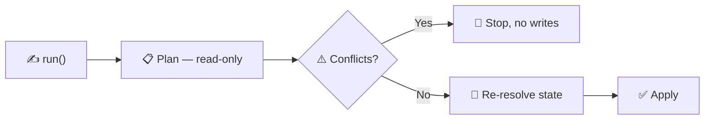

# 🍪 Muster

Aboard ship, a muster assembles the crew and accounts for every hand. In a
WordPress project, [Muster](https://github.com/pressgang-wp/pressgang-muster)
assembles content: posts, pages, terms, users, options, comments, menus, and
media — created through WordPress and plugin APIs, and accounted for on every
run.

Muster is a **WordPress-native toolkit for deterministic content provisioning
and development fixtures**. No Models, no ORM, no mapping of application objects
onto `wp_posts` and `wp_postmeta`. 🧭


Muster ships as a **standalone package**. It does **not** depend on the PressGang
theme framework — you can use it in any WordPress project. Its only requirements
are PHP and FakerPHP.


---

## 🌱 Why seed at all?

Most WordPress teams don't. A developer clones the repo, runs it, and gets an
empty site — then spends an afternoon clicking content into wp-admin so there's
something to look at. What they build isn't what anyone else has.

<table><thead><tr><th width="250">What most teams do today</th><th>What it costs</th></tr></thead><tbody><tr><td>Click test content in by hand</td><td>Nobody else has your content, and it vanishes on the next reset. The awkward states — a 90-character title, a missing hero image, an empty repeater — are exactly the ones nobody builds by hand.</td></tr><tr><td>Copy the production database down</td><td>Puts real customer data on developer laptops. Gigabytes to move, and stale within a week.</td></tr><tr><td>Share a <code>.sql</code> dump or WXR export</td><td>Opaque and unreviewable — nobody can see in a pull request what changed, and it drifts away from the code it exists to support.</td></tr><tr><td>Work against an empty site</td><td>The bugs your editors hit don't appear until an editor hits them.</td></tr></tbody></table>

**Seeding replaces all four with a PHP class you commit.** It says "this site has
an About page, five articles, and a main menu" — and one command makes it so, on
any machine, as many times as you like.

That pays off the moment you have:

* **A new team member** — `composer install && wp capstan seed`, and they have the
  real thing in a minute rather than an afternoon.
* **Tests or CI** — automated checks need content, and need the *same* content on
  every run.
* **Visual regression** — a screenshot diff is noise unless the content is
  identical every time. This is what [Shakedown](SHAKEDOWN.md) is built on.
* **Editorial edge cases** — the sparse-but-valid states where empty-link and
  missing-image bugs hide.

---

## ✨ Why Muster?

Seeding only helps if the seed is trustworthy. Muster makes that content
**declarative** (describe the end state, not the steps), **idempotent** (re-running
converges instead of duplicating), and **deterministic** (the same seed produces
the same site).

| | Benefit | How |
| --- | --- | --- |
| 🔁 | **Re-run it forever, safely** | A stable logical key — not the slug — is identity, so a second run updates rather than duplicates. Rename a slug and it still resolves. |
| 🎲 | **Same seed, same site** | Randomness and time are explicit inputs, not ambient state. Two machines, two months apart, produce identical content. |
| 👀 | **See it before it happens** | Every run plans first and reports what it will create, update, keep, or delete. Conflicts stop the write. |
| 🔐 | **It only touches what it made** | An ownership registry means `resetOwned()` never deletes the client's real pages sitting in the same database. |
| ⚓ | **WordPress-native, no ORM** | Builders write through `wp_insert_post()` and friends, so hooks fire, caches invalidate, and ACF behaves as it does in wp-admin. |
| 👥 | **Fixtures live in code review** | A colleague can read the diff of your content in a PR — not a sentence anyone says about a `.sql` file. |


Muster takes useful inspiration from seeders and factories in Laravel, Rails, and
other frameworks. It adapts those ideas to WordPress rather than porting their
persistence models.


---

## 📦 Install

Install it in the child theme (or plugin) that owns the fixtures:


```bash
composer require --dev pressgang-wp/muster
```


**Requirements:** PHP 8.3+, FakerPHP 1.24+, a loaded WordPress runtime when
resources are persisted, and WP-CLI for the `wp capstan` commands.

A development dependency is right for local setup, CI, and disposable test
environments. If a controlled non-production runtime needs Muster after a
`composer install --no-dev`, install it as a regular dependency instead.

Seeders live in a top-level `muster/` directory, mapped under your composer
`autoload-dev` — they are development and test fixtures, not production theme
code, so they belong beside the dev-only Muster dependency, not in the shipped
`src/`:


```json
"autoload-dev": { "psr-4": { "App\\Muster\\": "muster/" } }
```


(`wp capstan make muster` scaffolds into `muster/` and prints this mapping.)


Muster is **pre-1.0**. The public API may still change between minor versions —
pin an exact version if that matters to you.


---

## 🚀 Your first Muster



#### Describe the content

A Muster is one class with a `run()` method. Every builder needs a `key()` — the
stable name Muster uses to recognise this resource on the next run.


```php
<?php

namespace App\Muster;

use PressGang\Muster\Muster;

final class SiteMuster extends Muster
{
    public function run(): void
    {
        $this->page()
            ->key('page:about')
            ->title('About us')
            ->slug('about-us')
            ->status('publish')
            ->content($this->victuals()->paragraphs(3))
            ->save();
    }
}
```




#### Preview it — no writes


```bash
wp capstan seed --dry-run
```


```text
Plan:
  CREATE   post   [site] page:about -> about-us
  Summary: create=1 update=0 keep=0 prune=0 conflict=0
```



#### Apply it


```bash
wp capstan seed --seed=1234
```


Muster prints the plan, re-resolves WordPress state, then writes.



#### Run it again


```bash
wp capstan seed --seed=1234
```


```text
Plan:
  KEEP     post   [site] page:about -> about-us
  Summary: create=0 update=0 keep=1 prune=0 conflict=0
```

**No duplicate. No drift.** That's the whole idea.



---

## 🧠 Mental model

| Concept | Responsibility |
| --- | --- |
| `Muster` | The orchestration entry point. A subclass implements `run()` and describes one provisioning flow. |
| Builders | Collect intent for one WordPress resource and write it through the relevant WordPress API on `save()`. |
| Logical keys | Stable identity within one concrete Muster class, independent of mutable locators such as slugs. |
| `Victuals` | A curated Faker wrapper for seeded headlines, content, names, addresses, and dates. |
| Fixture clock | One immutable epoch for relative dates, independent of Faker's random seed. |
| Groups | Named callback boundaries selected by `--only`; skipped callbacks are not evaluated. |
| `Pattern` | Repeats any declaration recipe a declared number of times, with an optional pattern seed. |
| Recipes, states, sequences | Reusable resource recipes, named transformations, and immutable cycling values. |
| Refs | Immutable save results, plus logical-key `LazyRef` handles resolved at save-time. |
| `RunReport` | Ordered `create`, `update`, `keep`, `prune`, and `conflict` results for one pass. |
| ACF generation | Reads `acf-json` definitions and produces minimal or populated field values. |

Patterns can repeat posts, terms, users, options, comments, attachments, menus,
or any custom declaration implementing `PressGang\Muster\Contracts\PersistableDeclaration`.

---

## ✍️ A fuller example


```php
<?php

namespace App\Muster;

use PressGang\Muster\Muster;

final class SiteMuster extends Muster
{
    public static function defaultEpoch(): string
    {
        return '2026-01-01 09:00:00+00:00';
    }

    public function run(): void
    {
        $this->group('site-shell', function (): void {
            $about = $this->page()
                ->key('page:about')
                ->title('About us')
                ->slug('about-us')
                ->status('publish')
                ->content($this->victuals()->paragraphs(3))
                ->save();

            $this->attachment('about-hero')
                ->key('attachment:about-hero')
                ->placeholder(1200, 800, 'About us')
                ->alt('Our team at work')
                ->featuredOn($about)
                ->save();

            $this->menu('Main Menu')
                ->key('menu:main')
                ->postItem($about, 'About')
                ->link('Contact', '/contact/')
                ->location('main-menu')
                ->save();

            $this->comment($about)
                ->key('comment:about:welcome')
                ->author('Fixture Editor')
                ->email('fixtures@example.test')
                ->date($this->at('+1 day')->format('Y-m-d H:i:s'))
                ->content('Welcome to the fixture discussion.')
                ->status('approve')
                ->save();
        });

        $this->group('articles', function (): void {
            $this->pattern('article-fixtures')
                ->seed(1201)
                ->count(5)
                ->withThumbnail()
                ->build(
                    fn (int $i) => $this->content()
                        ->slug('article-' . $i)
                        ->date($this->at('-' . $i . ' weeks')->format('Y-m-d H:i:s'))
                );
        });
    }
}
```


Every write goes through WordPress-native functions such as `wp_insert_post()`,
`wp_update_post()`, `wp_insert_term()`, `wp_update_user()`, and
`wp_update_nav_menu_item()`. ACF values use its public `update_field()` API.


**Less ceremony, same guarantees** (see [ADR 0006](https://github.com/pressgang-wp/pressgang-muster/blob/main/docs/adr/0006-seeder-authoring-ergonomics.md)):

- **Pattern rows self-key** from the pattern name and one-based index
  (`article-fixtures:1`, `article-fixtures:2`, …) when the recipe sets no
  `key()` — stable and independent of the slug, so re-runs and resets behave
  exactly as with a hand-written key. Call `key()` to override it.
- **`withThumbnail()`** gives each row a deterministic placeholder featured
  image without a hand-written after-hook.
- **A post's `status` defaults to `publish` and its `date` to the fixture
  epoch** on first insert — so the common row writes neither. An explicit
  `status()`/`date()` still wins, and the default applies to inserts only, never
  overwriting a field on a re-run.
- **`content($type)`** returns a post pre-filled with a generated title, body,
  and the ACF values `acfFor($type)` derives — the "populated content" shape in
  one place. Override any field afterwards; it is opt-in, so bare `post()` still
  writes only what you declare (what the sparse "minimal" fixtures rely on).


<details>

<summary><strong>Reusable recipes, states, and sequences</strong></summary>

A **Recipe** is a reusable class for one resource shape — a Recipe uses Victuals
to produce a resource declaration, not a Model or attribute map (see ADR 0007).
It lives in the theme's `muster/Recipes/` directory: implement `define()` with the
default shape, and add named variations as methods that return `$this->state(...)`.


```php
final class ArticleRecipe extends \PressGang\Muster\Patterns\Recipe
{
    public function define(int $i): PostBuilder
    {
        return $this->content('post')->slug('article-' . $i);   // populated title/body/ACF
    }

    public function featured(): static
    {
        return $this->state(fn (PostBuilder $b, int $i) => $b->meta(['featured' => true]));
    }
}
```


Reuse it in a seed or a test — `count()->create()` seeds a self-keyed batch,
states compose immutably, and `Pattern::using()` feeds it to a pattern:

```php
$this->recipe(ArticleRecipe::class)->count(6)->withThumbnail()->create();
$this->recipe(ArticleRecipe::class)->featured()->count(2)->create();

// or drive a Pattern directly, e.g. to attach an after-hook:
$this->pattern('articles')->count(6)
    ->after('welcome-comment', fn ($post, int $i) => $this->comment($post)
        ->key('comment:article:' . $i)->author('Fixture Editor')->content('Welcome'))
    ->using($this->recipe(ArticleRecipe::class));
```

Because a Recipe is a plain class, the *same* shape seeds your dev content and
arranges a scenario in a test — the ORM-free equivalent of a Laravel factory used
in both a seeder and a test.

</details>

<details>

<summary><strong>Ordered Musters and logical-key references</strong></summary>

Split a large scenario into focused dependencies without creating separate run
state:

```php
$this->call(AuthorMuster::class, ArticleMuster::class);
```

Called Musters share the clock, seeded Victuals stream, ownership registry, group
selection, and report. Calls run in declared order; recursion and duplicate
execution fail with a dependency-path diagnostic. This makes a `SiteMuster` that
only calls focused children — like Laravel's `DatabaseSeeder` — the idiomatic way
to organise a larger seed: `wp capstan seed` runs the root, and each child is
reached exactly once. Because the ownership registry is shared, `acfFor()` support
resources are deduped across the whole graph, so children targeting the same field
group never collide over the same placeholder.

`ref()` addresses the same stable logical key used for ownership. It can be
captured **before** the target exists, because the consuming builder resolves it
on `save()`:

```php
$about = $this->ref('page:about');
$menu = $this->menu('Main Menu')->key('menu:main')->postItem($about, 'About');

$this->page()->key('page:about')->title('About')->slug('about')->save();
$menu->save();
```

On a clean first run, save the target before its consumer. To reference a key
owned by a called Muster, pass that class explicitly:
`$this->ref('user:editor', AuthorMuster::class)`.

</details>

<details>

<summary><strong>Shorthand for registered post types</strong></summary>

Any registered post type is callable directly on the Muster, as shorthand for
`post()`:

```php
$this->event()               // same as $this->post('event')
$this->event('Summer show')  // same as $this->post('event')->title('Summer show')
```

Resolution is delegated to WordPress: the method name must be a post type that
is **registered at call time**, or the call throws `BadMethodCallException`.
A post type whose name collides with a real Muster method (such as `post`) will
never reach the shorthand.

</details>

---

## 🔁 Persistence semantics

Every builder created through a Muster requires an explicit `key()`. The concrete
Muster class plus that key form stable identity; the native WordPress locator is
how Muster **discovers** the current object.

Posts, terms, users, and comments use **merge-upsert** semantics:



#### Resolve
Find an owned resource by Muster class and logical key.



#### Check
Inspect the current WordPress locator for collisions.



#### Create or update
Create when absent. When present, update **only** the fields explicitly supplied.



#### Preserve
Omitted fields keep their existing WordPress values. An explicitly empty value
clears a field.



| Resource | Current locator |
| --- | --- |
| Post, page, or CPT | Post type + slug |
| Term | Taxonomy + slug |
| User | Login |
| Option | Option name |
| Comment or reply | Post + parent + type + author identity + deterministic GMT date |
| Attachment | Attachment slug |
| Menu | Menu name |


**A locator match does not prove ownership.** If a matching resource exists but is
not registered to this Muster key, saving fails. Call `adopt()` only when the
declaration intentionally takes responsibility for that existing object. Adoption
never steals a resource already owned by another Muster or key.


<details>

<summary><strong>Per-builder behaviour worth knowing</strong></summary>

* **Users** — new users must declare `->password('initial-password')`. Muster
  sends it only when `wp_insert_user()` creates the user. Later runs leave
  credentials untouched, because WordPress stores a one-way hash that cannot be
  compared safely with a plaintext declaration.
* **Comments** — no slug, so the locator uses post, parent, type, author email
  (or name), and GMT date. Content stays mutable and can be revised without
  creating a duplicate. Pin `date()` or define a scenario epoch so an otherwise
  identical declaration has a stable locator. `CommentRef` can be passed to
  `parent()` to build threaded replies.
* **Options** — use WordPress's own option upsert behaviour.
* **Attachments** — create a file and attachment once, then reuse an existing
  attachment with the same slug. Changing the declared source does not currently
  regenerate an existing file.
* **Menus** — the declaration is authoritative: every existing item in the named
  menu is deleted and the declared items recreated in order.
* **`truncate()`** — permanently deletes every post of the selected type, or
  every term in the selected taxonomy.

Builders persist by **merge** because a declaration is a partial statement of
intent, never a complete resource. A builder that manufactured update defaults
would silently erase content Muster did not author.

</details>

---

## 👀 Plan and apply

Every CLI command runs the Muster in a read-only planning context first.



| Operation | Meaning |
| --- | --- |
| `create` | No owned or adopted resource currently exists. |
| `update` | The owned declaration differs, or has authoritative side effects. |
| `keep` | Comparable declared state already matches WordPress. |
| `prune` | An owned or explicitly truncated resource will be deleted. |
| `conflict` | Ownership or locator safety prevents application. |

Without `--dry-run`, Muster prints the plan and then performs a second pass that
re-resolves WordPress state and applies the declarations. WordPress has no
transaction spanning all of its resource APIs, so the apply pass **validates
again** rather than treating the earlier reads as a lock.


A normal CLI run calls `run()` **twice** — once to plan, once to apply. Keep
`run()` declarative: no email, no remote APIs, no writes outside Muster builders.


Core post, term, user, and option fields can be proven unchanged and reported as
`keep`. ACF/meta/taxonomy payloads and authoritative menu rebuilds are
conservatively reported as updates until their adapters expose comparable read
contracts. Programmatic integrations can inspect
`$context->report()->operations()`, `summary()`, or `toArray()`. Each structured
operation includes the declaration `group` that produced it, or `null` for an
ungrouped run.

---

## 🔐 Ownership, adoption, and cleanup

Muster stores ownership records in the non-autoloaded
`pressgang_muster_registry` option. Records hold the concrete Muster class,
logical key, resource kind, WordPress ID, subtype, and current locator.
WordPress remains the source of truth for the resource itself.

```php
$this->page()
    ->key('page:about')
    ->adopt() // only to claim a pre-existing, unowned page
    ->title('About us')
    ->slug('about-us')
    ->save();

$this->resetOwned();                  // delete everything this Muster owns
$this->pruneOwned();                  // delete owned keys not touched this run
$this->pruneOwned(['page:seasonal']); // ...but also keep this one
```

`pruneOwned()` automatically keeps keys saved in the current run, including
reserved `acf:*` support keys. Its optional array means **"also keep"**, not
"complete manifest". Both operations leave editor-created and other unowned
content alone.


**Never prune after a partial `--only` run.** Declarations in skipped groups
cannot be judged stale. Muster enforces this: `resetOwned()` and `pruneOwned()`
fail when `--only` is active, because they reconcile the complete ownership scope.


---

## 📋 The declarative manifest

For the common whole-surface case — some terms, populated content per type, a
page per template, a menu per location — a `SiteMuster` can declare a **manifest**
instead of writing each builder. `assemble()` derives all of it through the same
primitives (self-keyed patterns, `withThumbnail()`, `content()`), so determinism,
ownership, and plan/apply are identical to a hand-written seed:


```php
public function run(): void
{
    $this->assemble([
        'terms' => ['hit_group' => 3],                      // taxonomy => count
        'posts' => [
            'hit'   => ['count' => 5, 'thumbnail' => true, 'terms' => ['hit_group' => 'rotate']],
            'post'  => ['count' => 5, 'thumbnail' => true],
            'event' => ['count' => 5, 'thumbnail' => true, 'terms' => ['hit_group' => 'rotate']],
        ],
        'pages' => 'templates',    // one page per registered page template
        'menus' => 'locations',    // a menu per registered nav location
    ]);
}
```


Each section runs in its own group (`terms:hit_group`, `posts:hit`, `pages`,
`menus:primary`), so `--only` selects it. The manifest is the terse default; for
anything it can't express — bespoke relationships, conditional content — write a
Muster class and `$this->call()` it. The two compose: a manifest for the bulk, a
class for the exceptions. See [ADR 0006](https://github.com/pressgang-wp/pressgang-muster/blob/main/docs/adr/0006-seeder-authoring-ergonomics.md).

## 🌱 Conventional development seed

[Capstan](CAPSTAN.md) can inspect the active theme and scaffold a starting
`SiteMuster` from its registered post types, taxonomies, page templates, menu
locations, and ACF JSON:


```bash
wp capstan make muster          # preview muster/SiteMuster.php
wp capstan make muster --force  # write it once
```



`make muster` is provided by **Capstan**. The `seed` and `muster` commands below
ship with Muster itself.


The generated file is owned by the child theme and is never overwritten by the
scaffold. It pins a `defaultEpoch()` and creates groups such as
`taxonomy:event_type`, `content:event`, `page:contact`, and `menu:main-menu`.
Edit its counts, names, content, relationships, group names, and logical keys to
fit the project.




```bash
wp capstan seed --seed=1234     # run the conventional SiteMuster
wp capstan seed --dry-run       # plan without writes
wp capstan seed --fresh         # reset this Muster's owned resources, then run
wp capstan seed --only=content:event
wp capstan seed --format=json   # machine-readable plan and apply reports
wp capstan seed --verbose       # builder and operation identity details
wp capstan seed --quiet         # suppress successful human output
```



`wp capstan seed` refuses to run when `WP_ENVIRONMENT_TYPE` is `production`.
There is no override flag.





```bash
wp capstan muster App\\Muster\\DemoMuster --seed=1234
wp capstan muster App\\Muster\\DemoMuster --dry-run
wp capstan muster App\\Muster\\DemoMuster --only=articles
wp capstan muster App\\Muster\\DemoMuster --format=json
wp capstan muster App\\Muster\\DemoMuster --verbose
```


The lower-level runner: you name the class, it runs. It has no production guard
and no `--fresh`.



| Flag | Effect |
| --- | --- |
| `--seed=<int>` | Sets the global seed. |
| `--epoch=<datetime>` | Pins the fixture clock; overrides `defaultEpoch()`. |
| `--dry-run` | Full read-only plan, stops before application. |
| `--only=<csv>` | Runs only the named declaration groups. |
| `--fresh` | (`seed` only) Deletes resources owned by that Muster, then runs. |
| `--format=json` | One object with `status`, ordered `operations`, and `summary`. No human log lines. |
| `--verbose` | Declared field **names** and full operation identity — never values. |
| `--quiet` | Suppresses progress and reports on success; errors remain visible. |



### Groups and `--only`

`--only` filters named declaration **groups**. Put an explicit callback boundary
around every independently selectable part of the scenario:

```php
$this->group('articles', function (): void {
    $this->page()->key('page:articles')->title('Articles')->slug('articles')->save();

    $this->pattern('article-fixtures')->count(5)->build(
        fn (int $i) => $this->post()
            ->key('article:' . $i)
            ->title($this->victuals()->headline())
            ->slug('article-' . $i)
    );
});
```

A skipped callback is **never invoked**, so builders, Patterns, Victuals calls,
and ACF provisioning inside it perform no reads, writes, or random draws. Names
must be non-empty and unique within one pass; groups cannot be nested. Unknown
`--only` names fail rather than silently doing nothing.

When `--only` is active, data declarations outside groups also fail. Without
`--only`, ungrouped declarations remain valid. Combining `--fresh` with `--only`
intentionally clears everything the Muster owns, then rebuilds only the selected
groups.


`--fresh` is ownership-aware and needs no custom `fresh()` method. The broad
`truncate()` builder remains available for deliberately disposable databases, but
the conventional fresh seed does not use it.


---

## 🎲 Determinism

Randomness and time are **separate inputs**.



An explicit seed gives Faker-backed values a repeatable sequence:


```bash
wp capstan seed --seed=1978
```


A Pattern seed overrides the run seed for that Pattern. Calls within a Pattern
share one scoped `Victuals` instance, so the sequence is stable when the seed,
call order, locale, and inputs are stable.



The fixture epoch defines what relative dates mean:

```php
public static function defaultEpoch(): string
{
    return '2026-01-01 09:00:00+00:00';
}
```

Use `$this->epoch()` for the reference instant and `$this->at('+1 week')` for a
resolved date. Victuals `date()`, `datetime()`, and `dateBetween()` use that same
clock. Override temporarily:


```bash
wp capstan seed --epoch="2027-04-05 09:00:00+00:00"
```


An explicit CLI epoch takes precedence over `defaultEpoch()`.



Without either input, Muster captures the system clock **once** and shares it
across plan and apply. That keeps one invocation coherent, but does not make
separate invocations repeatable.


**Two limits.** Faker's seeding uses PHP's global `mt_rand` stream, so
interleaving independently seeded Faker instances can change their sequences. And
`victuals()->raw()` bypasses Muster's curated clock behaviour.


<details>

<summary><strong>WordPress-shaped content helpers</strong></summary>

* `imageUrl($width, $height, $label)` — a seeded, self-contained SVG data URL
  with no external placeholder service. For a real Media Library object, use
  `AttachmentBuilder::placeholder()` instead.
* `gutenbergBlocks($paragraphs)` — serialized core heading and paragraph blocks.
* `richContent($sections)` — escaped semantic HTML with headings, lists, links,
  and a blockquote.
* `repeaterRows($count, $schema)` — ACF-shaped row arrays. Callable schema values
  receive the Victuals instance and the one-based row index; constants are copied
  into each row.

</details>

[Shakedown](SHAKEDOWN.md) supplies a fixed seed and pins published dates inside
its disposable sandbox, which keeps its generated visual fixtures stable.

---

## 🧬 ACF-derived coverage fixtures

`acf-json` is the machine-readable description of a theme's editorial surface.
Muster reads it to generate values, instead of duplicating every field definition
in seed code:

```php
$this->post('event')
    ->key('event:example')
    ->title('Example event')
    ->slug('example-event')
    ->acf($this->acfFor('event'))
    ->save();
```

| Variant | Fills |
| --- | --- |
| `populated` (default) | Every generatable field. |
| `minimal` | Required fields only, including required nested sub-fields. |

The generator handles common scalar fields plus groups, repeaters, flexible
content, galleries, and relational fields.

The target is any location value a field group declares: a post type (`event`),
a page **or** post template path (`page-templates/contact.php`), an options-page
slug (`site-options`), a `page_type` such as `front_page`, or a nav-menu-item
location (`location/primary`). Groups on any of these resolve — not just post
types and page templates.


**`acfFor()` is provisioning, not a side-effect-free lookup.** Relational and
media fields need real WordPress IDs, so it may create supporting attachments,
posts, or terms. Those receive reserved `acf:*` logical keys and are owned by the
**run's root Muster** — so several chained seeders that target the same field
group share one placeholder rather than contending to own it. Relationship stub
posts are dated a year before the fixture epoch and carry a placeholder featured
image, so they never head date-ordered feeds or render thumbnail-less — and,
because the date derives from the shared clock, output stays deterministic.


When ACF is active, the CLI wires `LiveAcfAdapter` and writes through
`update_field()`. When ACF is unavailable, ACF payloads are not persisted.

This is especially valuable to [Shakedown](SHAKEDOWN.md): every ACF field group
gets populated **and** minimal fixtures in an isolated sandbox, exercising both
rich content and the sparse-but-valid editorial states where empty-link and
missing-image bugs hide.

---

## 🧰 Builder reference

<details>

<summary><strong>Entry points</strong></summary>

| Entry point | Creates or updates |
| --- | --- |
| `$this->group('articles', fn () => ...)` | A named declaration boundary selectable by `--only` |
| `$this->post('event')->key('event:1')` | Posts and custom post types |
| `$this->page()->key('page:about')` | Pages |
| `$this->term('category')->key('category:news')` | Taxonomy terms |
| `$this->user('editor')->key('user:editor')->password('initial-password')` | Users; passwords are create-only |
| `$this->option('name')->key('option:name')` | Options |
| `$this->comment($post)->key('comment:welcome')` | Comments and threaded replies |
| `$this->attachment('hero')->key('attachment:hero')` | Media attachments and deterministic placeholders |
| `$this->menu('Main Menu')->key('menu:main')` | Navigation menus, items, nesting, and locations |
| `$this->resetOwned()` | Every resource owned by this concrete Muster |
| `$this->pruneOwned([...])` | Stale owned resources not touched or additionally retained |
| `$this->truncate()` | Immediate destructive post-type or taxonomy reset |

</details>

Refs returned by `save()` carry real WordPress IDs without exposing
database-table details. Pass them to post and comment parents, menu items,
attachment relationships, and featured-image assignments. `ref('logical:key')`
gives a save-time handle backed by the same ownership registry.

---

## 🧪 Real WordPress verification

Muster keeps a fast PHPUnit 11 suite for focused feedback, plus a separate
WordPress 7 / PHPUnit 9 integration harness for behaviour that stubs cannot
prove — posts, terms, users, options, comments, ownership, dry-run planning,
merge updates, and pruning against real core APIs and a real MySQL database.


```bash
export WP_TEST_DB_NAME=muster_test
export WP_TEST_DB_USER=root
export WP_TEST_DB_PASSWORD=secret
export WP_TEST_DB_HOST=127.0.0.1
bin/run-integration-tests.sh
```



**The database must be disposable.** WordPress's test harness installs and clears
its prefixed tables. Never point it at a real site.


GitHub Actions runs the unit suite on PHP 8.3 and 8.4, plus the integration suite
against WordPress 7.0.1.

Test cases can `use AssertsWordPressFixtures` for focused post, term, user,
option, and comment assertions. `MusterSnapshot::serialize()` and
`assertMatches()` produce versioned structured-report JSON for regression checks.
Volatile WordPress IDs are omitted by default; include them only when the
database lifecycle makes them stable. Snapshot creation or replacement requires
an explicit `write()`.

---

## 🛳️ With the fleet

* **[Capstan](CAPSTAN.md)** scaffolds the theme's `SiteMuster` via
  `wp capstan make muster`.
* **[Shakedown](SHAKEDOWN.md)** uses Muster for ACF-derived state fixtures in a
  disposable WordPress sandbox.
* **[Bosun](BOSUN.md)** can brief coding agents on the installed PressGang tools
  and project conventions.
