# ⚓ Quartermaster

Quartermaster is a fluent, args-first query builder for `WP_Query` and `WP_Term_Query`. It helps you build complex query arrays in readable, composable steps while staying **100% WordPress-native under the hood**.

Think of it as a reliable quartermaster for your query cargo — you decide what goes aboard, nothing gets smuggled in. 🧭


Quartermaster ships as a **standalone package** in the PressGang ecosystem. It does **not** depend on the PressGang theme framework — you can use it in any WordPress project.


## 📦 Install


```bash
composer require pressgang-wp/quartermaster
```


**Requirements:** PHP 8.3+

---

## ✨ Why Fluent?

`WP_Query` arrays are powerful, but as they grow they become harder to scan, review, and refactor.

```mermaid
graph LR
    A["✍️ Fluent methods"] --> B["📦 Plain WP args"]
    B --> C["⚙️ WP_Query / WP_Term_Query"]
    C --> D["📋 Posts or Terms"]
```



| | Benefit | How |
|---|---|---|
| 📖 | **Better readability** | Query intent is expressed step-by-step |
| 🧩 | **Better composability** | Add or remove clauses without rewriting a large array |
| 🛡️ | **Better safety** | Methods are explicit about which WP args they set |
| 🔍 | **Better debugging** | Inspect exact output with `toArgs()` and `explain()` |

You still end up with **plain WordPress args**. No ORM. No hidden query engine. No lock-in. Just well-organised cargo. ⚓


Sometimes raw `WP_Query` is fine — if your query is short and static, use it. Quartermaster shines when queries evolve, branch, or need to be composed without losing your bearings.


---

## 🧠 Design Philosophy

Quartermaster is intentionally light-touch. Steady hands on the wheel, predictable seas ahead. 🚢

| Principle | Meaning |
|---|---|
| 🧱 WordPress-native | Every fluent method maps directly to real `WP_Query` / `WP_Term_Query` keys |
| 🫙 Zero side effects | `Quartermaster::posts()->toArgs()` returns `[]` — nothing gets smuggled in |
| 🎯 Opt-in only | Nothing changes unless you call a method |
| 🔌 Loosely coupled | No mutation of WordPress internals, no global state changes |
| 🌲 Timber-agnostic | Timber support is optional and runtime-guarded |
| 🧭 Explicit over magic | Sharp WP edges are documented, not hidden |


**Non-goals** — Quartermaster deliberately does **not** aim to replace `WP_Query`, act as an ORM, hide WordPress limitations (e.g. tax/meta OR logic), or infer defaults. If WordPress requires a specific argument shape, Quartermaster expects you to be explicit. No fog, no siren songs. 🧜‍♀️


---

## 🚀 Posts — Quick Start

`posts('event')` is a convenience seed — it only sets `post_type` and does not infer any other query args.



Build an args array without executing the query:


```php
use PressGang\Quartermaster\Quartermaster;

$args = Quartermaster::posts()
    ->postType('event')
    ->status('publish')
    ->paged(10)
    ->orderByMeta('start', 'ASC')
    ->search(get_query_var('s'))
    ->toArgs();

// $args is a plain WP_Query-compatible array — use it however you like
$query = new WP_Query($args);
```




Execute the query and get posts in one step:


```php
$posts = Quartermaster::posts()
    ->postType('event')
    ->status('publish')
    ->limit(6)
    ->get();

// $posts is an array of WP_Post objects
```




When you need the full `WP_Query` object (pagination metadata, found rows, loop state):


```php
$query = Quartermaster::posts()
    ->postType('event')
    ->status('publish')
    ->paged(12)
    ->wpQuery();

$posts      = $query->posts;
$total      = $query->found_posts;
$totalPages = $query->max_num_pages;
```




Get Timber `PostQuery` objects directly — ideal for PressGang controllers:


```php
$posts = Quartermaster::posts()
    ->postType('event')
    ->status('publish')
    ->paged(12)
    ->timber();
```



Timber is optional and runtime-guarded. If Timber is unavailable, Quartermaster throws a clear `RuntimeException` rather than hard-coupling Timber into core.




---

## 📌 Post Constraints

Filter by ID, parent, author, and status — all with type-safe integer handling.




```php
// Single post by ID
$q = Quartermaster::posts()->whereId(42);

// Multiple specific posts
$q = Quartermaster::posts()->whereInIds([10, 20, 30]);

// Exclude specific posts
$q = Quartermaster::posts('post')
    ->excludeIds([$stickyPost->ID])
    ->status('publish');
```



All ID methods filter non-integer values automatically and skip silently if the resulting list is empty. No invalid args, no broken queries.





```php
// Direct children of a page
$children = Quartermaster::posts('page')
    ->whereParent($parentPage->ID)
    ->orderBy('menu_order', 'ASC')
    ->get();

// Children of multiple parents
$q = Quartermaster::posts('page')
    ->whereParentIn([10, 20, 30]);
```





```php
// Posts by one author
$q = Quartermaster::posts()->whereAuthor($userId);

// Posts by multiple authors
$q = Quartermaster::posts()->whereAuthorIn([1, 5, 12]);

// Exclude authors
$q = Quartermaster::posts()
    ->whereAuthorNotIn([$botUserId])
    ->status('publish');
```




---

## 🔎 Meta Queries

Build `meta_query` clauses fluently — from simple key/value checks to complex nested conditions.




```php
// Exact match
$q = Quartermaster::posts('event')
    ->whereMeta('featured', '1');

// Numeric comparison
$q = Quartermaster::posts('product')
    ->whereMeta('price', 50, '>=', 'NUMERIC');

// Multiple AND conditions
$q = Quartermaster::posts('event')
    ->whereMeta('featured', '1')
    ->whereMeta('capacity', 0, '>', 'NUMERIC');
```





```php
// Posts matching ANY of these conditions
$q = Quartermaster::posts('event')
    ->orWhereMeta('priority', 'high')
    ->orWhereMeta('featured', '1');
```


This sets `relation => OR` on the root meta query — matching posts where **either** condition is true.




```php
// Upcoming events (meta date >= today)
$q = Quartermaster::posts('event')
    ->whereMetaDate('start', '>=')
    ->orderByMeta('start', 'ASC');

// Past events (meta date < today)
$q = Quartermaster::posts('event')
    ->whereMetaDate('start', '<')
    ->orderByMeta('start', 'DESC');

// Events after a specific date
$q = Quartermaster::posts('event')
    ->whereMetaDate('start', '>=', '20250601');
```



When no value is provided, `whereMetaDate()` uses today's date via WordPress's timezone-aware `wp_date()`. The default format is `Ymd` (ACF convention).





```php
// Posts that HAVE a video URL set
$q = Quartermaster::posts('lesson')
    ->whereMetaExists('video_url');

// Posts that DON'T have a legacy field
$q = Quartermaster::posts('product')
    ->whereMetaNotExists('legacy_sku');

// Exclude by value, including posts where key doesn't exist
$q = Quartermaster::posts('event')
    ->whereMetaNot('cancelled', '1');
```



`whereMetaNot()` creates a smart nested OR sub-group: `(!= value OR NOT EXISTS)`. This catches posts where the key was never set — a common gotcha with raw `meta_query`.





```php
// Match ACF relationship/checkbox fields stored as serialized arrays
$q = Quartermaster::posts('team_member')
    ->whereMetaLikeAny('department_ids', ['15', '42', '99']);
```


Builds a nested OR group of `LIKE` clauses targeting ACF's serialization format. Each value is wrapped in double-quotes to match the stored representation.



---

## 🏷️ Taxonomy Queries


```php
// Posts in a specific category (by slug)
$q = Quartermaster::posts('post')
    ->whereTax('category', 'news');

// Posts tagged with any of several tags
$q = Quartermaster::posts('post')
    ->whereTax('post_tag', ['php', 'wordpress', 'timber']);

// Posts in a category AND with a specific tag
$q = Quartermaster::posts('post')
    ->whereTax('category', 'tutorials')
    ->whereTax('post_tag', 'advanced');

// Query by term ID instead of slug
$q = Quartermaster::posts('product')
    ->whereTax('product_cat', [12, 34], 'term_id');

// Exclude a taxonomy term
$q = Quartermaster::posts('post')
    ->whereTax('category', 'uncategorized', 'slug', 'NOT IN');
```


---

## 📅 Date Queries


```php
// Posts published after a date
$q = Quartermaster::posts()
    ->whereDateAfter('2025-01-01');

// Posts published before a date
$q = Quartermaster::posts()
    ->whereDateBefore('2024-12-31');

// Posts in a date range
$q = Quartermaster::posts()
    ->whereDateAfter('2025-01-01')
    ->whereDateBefore('2025-06-30');

// Raw date clause for full WordPress date_query power
$q = Quartermaster::posts()
    ->whereDate(['year' => 2025, 'monthnum' => 6]);
```


---

## 📄 Pagination and Performance




```php
// Standard pagination — reads current page from query vars
$q = Quartermaster::posts('event')
    ->status('publish')
    ->paged(12);

// Fixed limit without pagination context
$featured = Quartermaster::posts('post')
    ->whereMeta('featured', '1')
    ->limit(3)
    ->get();

// Fetch ALL matching posts
$allEvents = Quartermaster::posts('event')
    ->status('publish')
    ->all()
    ->get();
```





```php
// Skip SQL_CALC_FOUND_ROWS when you don't need total count
$q = Quartermaster::posts('post')
    ->noFoundRows()
    ->limit(5);

// Return IDs only for maximum performance
$ids = Quartermaster::posts('event')
    ->idsOnly()
    ->status('publish')
    ->get();

// Control cache priming
$q = Quartermaster::posts('post')
    ->withMetaCache(false)   // Skip meta cache priming
    ->withTermCache(false);  // Skip term cache priming
```



Use `noFoundRows()` and `idsOnly()` when you don't need the full post objects or pagination counts. These can significantly reduce query overhead on high-traffic pages.




---

## ↕️ Ordering




```php
// Order by date (descending is default)
$q = Quartermaster::posts()->orderBy('date', 'DESC');

// Shorthand
$q = Quartermaster::posts()->orderByDesc('date');
$q = Quartermaster::posts()->orderByAsc('title');

// Order by menu order
$q = Quartermaster::posts('page')->orderBy('menu_order', 'ASC');
```





```php
// Order by meta value (string comparison)
$q = Quartermaster::posts('event')
    ->orderByMeta('start', 'ASC');

// Shorthand
$q = Quartermaster::posts('event')
    ->orderByMetaAsc('start');

// Numeric meta ordering (for prices, distances, etc.)
$q = Quartermaster::posts('product')
    ->orderByMetaNumericDesc('price');
```





Ordering direction is strict: only `ASC` and `DESC` are accepted. Invalid values are normalised to the method default and surfaced as a warning in `explain()`.


---

## 🏷️ Terms — Quick Start

Quartermaster also provides a fluent builder for `WP_Term_Query` via `Quartermaster::terms()`.




```php
$terms = Quartermaster::terms('category')
    ->hideEmpty()
    ->orderBy('name')
    ->limit(20)
    ->get();
```





```php
// Terms attached to a specific post
$tags = Quartermaster::terms('post_tag')
    ->objectIds($post->ID)
    ->get();
```





```php
// All descendants of a parent term
$children = Quartermaster::terms('category')
    ->childOf(5)
    ->excludeTree(12)
    ->get();

// Leaf categories only (no children)
$leaves = Quartermaster::terms('category')
    ->childless()
    ->get();

// Direct children of a parent
$directChildren = Quartermaster::terms('category')
    ->parent(5)
    ->get();
```





```php
// Find terms by slug
$genres = Quartermaster::terms('genre')
    ->slug(['rock', 'jazz'])
    ->hideEmpty(false)
    ->get();

// Find terms by name
$terms = Quartermaster::terms('category')
    ->name('Tutorials')
    ->get();

// Return IDs only
$ids = Quartermaster::terms('category')
    ->fields('ids')
    ->get();
```





```php
$timberTerms = Quartermaster::terms('category')
    ->hideEmpty()
    ->orderBy('name')
    ->timber();

// Returns array of Timber\Term objects
```





```php
// Paginate terms manually
$terms = Quartermaster::terms('category')
    ->page(2, 10)   // page 2, 10 per page
    ->get();

// Or set limit and offset directly
$terms = Quartermaster::terms('category')
    ->limit(10)
    ->offset(20)
    ->get();
```




---

## 🔗 Binding Query Vars

One of Quartermaster's most powerful features — bind URL query parameters directly to query clauses. Perfect for archive filtering, search pages, and faceted navigation.


Nothing reads query vars unless you explicitly call `bindQueryVars()`. No smuggling, no hidden defaults.




```mermaid
graph LR
    A["🌐 URL query vars"] --> B["bindQueryVars()"]
    B --> C["🔗 Bind / Binder"]
    C --> D["⚓ Quartermaster args"]
```

Two styles are supported — both compile to the same binding map.




```php
use PressGang\Quartermaster\Bindings\Bind;
use PressGang\Quartermaster\Quartermaster;

$q = Quartermaster::posts('route')->bindQueryVars([
    'paged'          => Bind::paged(),
    'orderby'        => Bind::orderBy('date', 'DESC', ['title' => 'ASC']),
    'shape'          => Bind::tax('route_shape'),
    'difficulty'     => Bind::tax('route_difficulty'),
    'min_distance'   => Bind::metaNum('distance_miles', '>='),
    'max_distance'   => Bind::metaNum('distance_miles', '<='),
    'search'         => Bind::search(),
]);
```





```php
use PressGang\Quartermaster\Bindings\Binder;
use PressGang\Quartermaster\Quartermaster;

$q = Quartermaster::posts('route')->bindQueryVars(function (Binder $b): void {
    $b->paged();
    $b->orderBy('orderby', 'date', 'DESC', ['title' => 'ASC']);
    $b->tax('district');                           // district -> district
    $b->tax('shape', 'route_shape');               // shape -> route_shape
    $b->tax('difficulty', 'route_difficulty');
    $b->metaNum('min_distance')->to('distance_miles', '>=');
    $b->metaNum('max_distance')->to('distance_miles', '<=');
    $b->search('search');
});
```



If no taxonomy is provided, Binder assumes the taxonomy name matches the query var key.




### Available bindings

| Binding | Purpose | Empty handling |
|---|---|---|
| `Bind::paged()` | Pagination from query var | Skips if ≤ 0 |
| `Bind::tax()` | Taxonomy filter | Skips if empty or null |
| `Bind::orderBy()` | Sort field + direction with per-field overrides | Falls back to default |
| `Bind::metaNum()` | Numeric meta comparison | Skips if null or empty |
| `Bind::search()` | Search query | Skips if empty; sanitised |


Every binding attempt is logged in `explain()` output — including whether it was applied, skipped, and why. Bound values are redacted for safety; only type shapes are shown.


---

## 🗓️ Common Pattern: Meta Date vs Today

Filtering by a meta date (e.g. upcoming vs past events) is a very common WordPress pattern:


```php
$isArchive = isset($_GET['archive']);

$q = Quartermaster::posts()
    ->postType('event')
    ->status('publish')
    ->whereMetaDate('start', $isArchive ? '<' : '>=')
    ->orderByMeta('start', $isArchive ? 'DESC' : 'ASC');
```


This keeps intent explicit — `whereMetaDate(...)` adds a `meta_query` DATE clause while `orderByMeta(...)` controls ordering separately. No hidden assumptions. No barnacles. ⚓

---

## 🔀 Conditional Queries

`when()`, `unless()`, and `tap()` keep fluent chains readable without introducing magic or hidden state. None of them read globals or add defaults.



Runs a closure when the condition is true:


```php
$q = Quartermaster::posts('event')
    ->when($isArchive, fn ($q) =>
        $q->whereMetaDate('start', '<')->orderByMeta('start', 'DESC')
    )
    ->when(! $isArchive, fn ($q) =>
        $q->whereMetaDate('start', '>=')->orderByMeta('start', 'ASC')
    );
```


Or with an else clause — cleaner when conditions are binary:


```php
$q = Quartermaster::posts('event')
    ->when(
        $isArchive,
        fn ($q) => $q->orderBy('date', 'DESC'),
        fn ($q) => $q->orderBy('date', 'ASC'),
    );
```




Inverse of `when()` — `unless($x)` is `when(!$x)`:


```php
$q = Quartermaster::posts('event')
    ->unless($isArchive, fn ($q) =>
        $q->whereMetaDate('start', '>=')->orderByMeta('start', 'ASC')
    );
```




Always runs a closure, for builder-level logic without breaking the chain:


```php
$q = Quartermaster::posts('event')
    ->tap(function ($q) use ($debug) {
        if ($debug) {
            $q->noFoundRows();
        }
    })
    ->when(!empty($authorIds), fn ($q) => $q->whereAuthorIn($authorIds))
    ->status('publish')
    ->paged(25);
```





All three are recorded in `explain()` for debuggability.


---

## 🔌 Macros

Macros let you register project-specific fluent methods without bloating the core API. They are opt-in — use them for patterns that repeat across your project.


```php
Quartermaster::macro('orderByMenuOrder', function (string $dir = 'ASC') {
    return $this->orderBy('menu_order', $dir);
});

Quartermaster::macro('published', function () {
    return $this->status('publish');
});

// Now use them anywhere
$posts = Quartermaster::posts('page')
    ->published()
    ->orderByMenuOrder()
    ->get();
```



Macros should call existing Quartermaster methods — avoid mutating internal args directly. Macro invocations are recorded in `explain()` as `macro:<name>` for debuggability.


Both builders (`Quartermaster` and `TermsBuilder`) support macros independently. Use `flushMacros()` in tests to clean up.

---

## 🪝 Escape Hatch: `tapArgs()`

When you need to set an arg that Quartermaster doesn't have a dedicated method for, use `tapArgs()` to manipulate the raw args array while preserving the fluent chain:


```php
$q = Quartermaster::posts('event')
    ->status('publish')
    ->tapArgs(fn (array $args) => array_merge($args, [
        'cache_results' => false,
        'suppress_filters' => true,
    ]));
```



The callback receives the current args array and must return the full replacement array. `tapArgs()` is recorded in `explain()` for debuggability.


---

## 🔍 Debugging and Introspection



Inspect the generated WordPress args array at any point in the chain:


```php
$args = Quartermaster::posts()
    ->postType('event')
    ->status('publish')
    ->whereMeta('featured', '1')
    ->toArgs();

// array(3) {
//   'post_type'   => 'event',
//   'post_status' => 'publish',
//   'meta_query'  => [['key' => 'featured', 'value' => '1', 'compare' => '=']]
// }
```




Inspect args **plus** the full call history, warnings, and binding log:


```php
$info = Quartermaster::posts()
    ->postType('event')
    ->orderBy('meta_value')  // ← no meta_key set!
    ->explain();

// $info['args']     → final WP_Query args
// $info['applied']  → [['name' => 'postType', 'params' => ['event']], ...]
// $info['warnings'] → ['Using orderby=meta_value without meta_key will produce unreliable ordering.']
```


When `bindQueryVars()` has been used, `explain()` also includes a `bindings` array showing each binding attempt — whether it was applied, skipped (and why), with values safely redacted.




`explain()` is perfect for code reviews, debugging, and making sure your queries do exactly what you intend. Think of it as the ship's manifest — every item accounted for. 🧭


### Smart warnings

Quartermaster automatically detects common gotchas:

| Warning | Trigger |
|---|---|
| Unreliable ordering | `orderby=meta_value` without `meta_key` set |
| Pagination ignored | `posts_per_page=-1` with `paged` set |
| Hidden empty terms | `hide_empty` not explicitly set on term queries |

---

## 📖 Method Reference

<details>
<summary><strong>🚢 Bootstrap</strong></summary>

| Method | Description |
|---|---|
| `Quartermaster::posts($postType?)` | Start a new post query builder |
| `Quartermaster::terms($taxonomy?)` | Start a new term query builder |
| `Quartermaster::prepare($postType?)` | Compatibility alias for `posts()` |

</details>

<details>
<summary><strong>📌 Post Constraints</strong></summary>

| Method | Sets |
|---|---|
| `postType(string\|array)` | `post_type` |
| `status(string)` | `post_status` |
| `whereId(int)` | `p` |
| `whereInIds(array)` | `post__in` |
| `excludeIds(array)` | `post__not_in` |
| `whereParent(int)` | `post_parent` |
| `whereParentIn(array)` | `post_parent__in` |
| `whereAuthor(int)` | `author` |
| `whereAuthorIn(array)` | `author__in` |
| `whereAuthorNotIn(array)` | `author__not_in` |

</details>

<details>
<summary><strong>🔎 Meta Queries</strong></summary>

| Method | Description |
|---|---|
| `whereMeta($key, $value, $compare?, $type?)` | AND meta clause |
| `orWhereMeta($key, $value, $compare?, $type?)` | OR meta clause |
| `whereMetaNot($key, $value)` | Exclude by value (handles NOT EXISTS) |
| `whereMetaDate($key, $operator, $value?, $format?)` | Date comparison (defaults to today) |
| `whereMetaExists($key)` | Key exists check |
| `whereMetaNotExists($key)` | Key does not exist check |
| `whereMetaLikeAny($key, $values)` | Match serialized ACF fields |

</details>

<details>
<summary><strong>🏷️ Taxonomy Queries</strong></summary>

| Method | Description |
|---|---|
| `whereTax($taxonomy, $terms, $field?, $operator?)` | Taxonomy query clause |

Field defaults to `slug`. Operator defaults to `IN`. Multiple calls produce AND relation.

</details>

<details>
<summary><strong>📅 Date Queries</strong></summary>

| Method | Description |
|---|---|
| `whereDate(array)` | Raw WordPress date_query clause |
| `whereDateAfter(string\|array, $inclusive?)` | Published after date |
| `whereDateBefore(string\|array, $inclusive?)` | Published before date |

</details>

<details>
<summary><strong>↕️ Ordering</strong></summary>

| Method | Description |
|---|---|
| `orderBy($orderby, $order?)` | Set order field and direction |
| `orderByAsc($orderby)` / `orderByDesc($orderby)` | Shorthand |
| `orderByMeta($key, $order?, $type?)` | Order by meta value |
| `orderByMetaAsc($key)` / `orderByMetaDesc($key)` | Shorthand meta ordering |
| `orderByMetaNumeric($key, $order?)` | Order by numeric meta |
| `orderByMetaNumericAsc($key)` / `orderByMetaNumericDesc($key)` | Shorthand |

</details>

<details>
<summary><strong>📄 Pagination and Performance</strong></summary>

| Method | Description |
|---|---|
| `paged($perPage?, $page?)` | Paginate (reads current page from query vars) |
| `limit(int)` | Fixed result count |
| `all()` | Fetch all (`posts_per_page=-1`, `nopaging=true`) |
| `noFoundRows()` | Skip `SQL_CALC_FOUND_ROWS` |
| `idsOnly()` | Return IDs only (`fields='ids'`) |
| `withMetaCache(bool)` | Toggle meta cache priming |
| `withTermCache(bool)` | Toggle term cache priming |

</details>

<details>
<summary><strong>🔀 Conditionals and Hooks</strong></summary>

| Method | Description |
|---|---|
| `when($condition, $then, $else?)` | Conditional closure |
| `unless($condition, $then, $else?)` | Inverse conditional |
| `tap($callback)` | Always-run closure |
| `tapArgs($callback)` | Raw args manipulation |

</details>

<details>
<summary><strong>🔌 Macros</strong></summary>

| Method | Description |
|---|---|
| `macro($name, $callable)` | Register a named macro |
| `hasMacro($name)` | Check if macro is registered |
| `flushMacros()` | Remove all macros (for tests) |

</details>

<details>
<summary><strong>🔗 Query-Var Binding</strong></summary>

| Method | Description |
|---|---|
| `bindQueryVars($bindings, $source?)` | Bind URL query vars to query clauses |
| `Bind::paged()` | Pagination binding |
| `Bind::tax($taxonomy, $field?, $operator?)` | Taxonomy binding |
| `Bind::orderBy($default, $dir, $overrides?)` | Order binding with per-field overrides |
| `Bind::metaNum($key, $compare)` | Numeric meta binding |
| `Bind::search()` | Search term binding |

</details>

<details>
<summary><strong>🔍 Introspection</strong></summary>

| Method | Returns |
|---|---|
| `toArgs()` | `array<string, mixed>` — raw WP_Query args |
| `explain()` | `array{args, applied, warnings, bindings?}` |

</details>

<details>
<summary><strong>🏁 Terminals</strong></summary>

| Method | Returns |
|---|---|
| `get()` | `WP_Post[]` — execute and return posts |
| `toArray()` | `array` — smart Timber/WP detection |
| `wpQuery()` | `WP_Query` — full query object |
| `timber()` | `Timber\PostQuery` — Timber post collection |

</details>

<details>
<summary><strong>🏷️ Terms Builder</strong></summary>

| Method | Description |
|---|---|
| `taxonomy(string\|array)` | Set taxonomy |
| `objectIds(int\|array)` | Scope to specific post(s) |
| `hideEmpty(bool)` | Hide/show empty terms |
| `slug(string\|array)` | Filter by slug |
| `name(string\|array)` | Filter by name |
| `fields(string)` | Control return fields (`ids`, `names`, `slugs`, `count`, etc.) |
| `include(array)` / `exclude(array)` | Include/exclude term IDs |
| `excludeTree(int\|array)` | Exclude entire term branches |
| `parent(int)` | Direct children only |
| `childOf(int)` | All descendants |
| `childless(bool)` | Leaf terms only |
| `search(string)` | Search terms |
| `limit(int)` / `offset(int)` | Limit and offset |
| `page(int, int)` | Convenience pagination |
| `orderBy(string, string)` | Order terms |
| `whereMeta()` / `orWhereMeta()` | Term meta queries |
| `get()` | Execute and return terms |
| `timber()` | Execute and return `Timber\Term[]` |

</details>

---

## 🔗 Links

- [GitHub: pressgang-wp/quartermaster](https://github.com/pressgang-wp/pressgang-quartermaster)
- [Packagist: pressgang-wp/quartermaster](https://packagist.org/packages/pressgang-wp/quartermaster)

Smooth seas and predictable queries. Happy sailing. ⚓🚢
